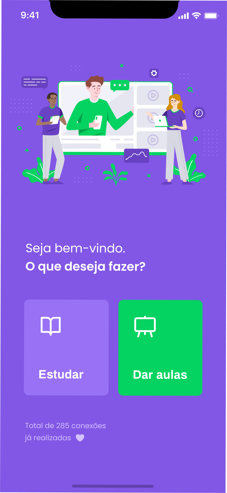

#Proffy   :green_heart:

###### Uma solução que conecta professores e alunos

*Tive o privilégio de construir essa aplicação do zero seguindo a semana Next Level Week,
nessa aplicação aprimorei o conceito de componentes no react e react native,
conhecendo uma forma mais pratica de reutilizar códigos, construindo uma aplicação responsiva.*

*Construir algo que pode conectar pessoas facilitando a comunicação isso me fascina!*

    

## Web :computer:

## Mobile :phone:

## Techs :mortar_board:
- **JS**
- **Node.js**
- **TypeScript**
- **ReactJS**
- **React Native**

